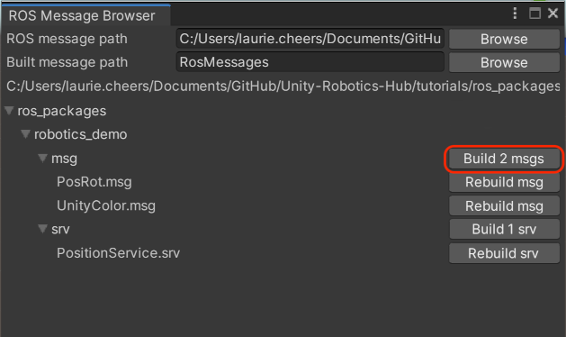

# ROS–Unity Integration: Subscriber

Create a simple Unity scene which subscribes to a [ROS topic](http://wiki.ros.org/ROS/Tutorials/UnderstandingTopics#ROS_Topics) to change the colour of a GameObject.

## Setting Up ROS

(Skip to [Setting Up Unity Scene](subscriber.md#setting-up-unity-scene) if you already did the [Publisher](publisher.md) tutorial.)

- Copy the `tutorials/ros_packages/robotics_demo` folder of this repo into the `src` folder in your Catkin workspace.

- Follow the [ROS–Unity Initial Setup](setup.md) guide.

- Open a new terminal window, navigate to your Catkin workspace, and run the following commands:
  
   ```bash
    source devel/setup.bash
    rosrun robotics_demo server_endpoint.py
   ```

Once the server_endpoint has started, it will print something similar to `[INFO] [1603488341.950794]: Starting server on 192.168.50.149:10000`.

- In Unity, we need to generate the C# code for the `UnityColor` message. Open `Robotics` -> `Generate ROS Messages...`.
    - Set the ROS message path to `PATH/TO/Unity-Robotics-Hub/tutorials/ros_packages/robotics_demo/`, expand the robotics_demo subfolder and click `Build 2 msgs`.
    


   - The generated files will be saved in the default directory `Assets/RosMessages/RoboticsDemo/msg`.

## Setting Up Unity Scene
- Create a script and name it `RosSubscriberExample.cs`
- Paste the following code into `RosSubscriberExample.cs`
    - **Note** Script can be found at `tutorials/ros_unity_integration/unity_scripts`

```csharp
using UnityEngine;
using RosColor = RosMessageTypes.RoboticsDemo.UnityColor;

public class RosSubscriberExample : MonoBehaviour
{
    public GameObject cube;

    void Start()
    {
        ROSConnection.instance.Subscribe<RosColor>("color", ColorChange);
    }

    void ColorChange(RosColor colorMessage)
    {
        cube.GetComponent<Renderer>().material.color = new Color32((byte)colorMessage.r, (byte)colorMessage.g, (byte)colorMessage.b, (byte)colorMessage.a);
    }
}
```

- Create an empty GameObject and name it `RosSubscriber`
- Attach the `RosSubscriberExample` script to the `RosSubscriber` GameObject and drag the cube GameObject onto the `cube` parameter in the Inspector window.

- From the Unity menu bar, open `Robotics/ROS Settings`, and set the `ROS IP Address` variable to your ROS IP.
    - Unlike the previous tutorial, using a subscriber requires an incoming connection from ROS to Unity. You may need to adjust your firewall settings for this to work.
    - The IP for Unity to listen on should be determined automatically, but if you're having trouble, you can set it manually in the `Override Unity IP` field. Finding the IP address of your local machine (the one running Unity) depends on your operating system.
        - On a Mac, open `System Preferences > Network`. Your IP address should be listed on the active connection.
        - On Windows, click the Wi-Fi icon on the taskbar, and open `Properties`. Your IP address should be listed near the bottom, next to "IPv4 address."

- Press play in the editor

### In ROS Terminal Window
- After the scene has entered Play mode, run the following command: `rosrun robotics_demo color_publisher.py` to change the color of the cube GameObject in Unity to a random color


Continue to the [ROS–Unity Integration Service](service.md).